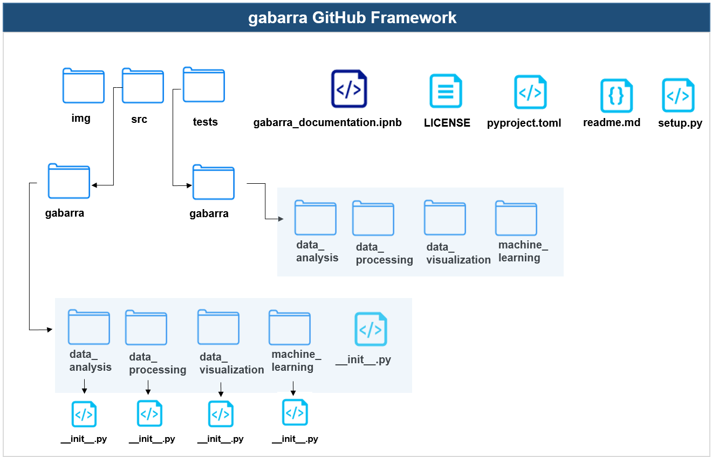

</div>

<div style="text-align:center">
    
</div>


[](https://www.thebridge.tech/) 

This is a quick guide to introduce you to Gabarra, a comprehensive toolkit designed to make a data scientist's workflow more efficient. It offers robust modules to help with tasks such as data analysis, processing, and visualization, in addition to providing functions that simplify the process of creating a machine learning model.

## Table of contents
- Installation
- Modules and Functions
    - Data Analysis
    - Data Visualization
    - Data Processing
    - Machine Learning
- Github framework
- Contributors
- License


## Installation

You can install this library using pip:

```python
!pip install gabarra
```

We suggest to import gabarra as gb, to make it easier to deploy by the users

```
import gabarra as gb
```


## Functions and methods

In the current version, gabarra will provide users 2 functions, divided in 4 groups:


| Data Analysis              | Data Processing            |
|----------------------------|----------------------------|
| `filter_rows()`            | `create_dummies()`         |
| `remove_outliers()`        | `fill_zeros_with_mean()`   |
| `basic_data_analysis()`    | `fill_nans_with_mean()`    |
| `outlier_meanSd()`         | `convert_to_numeric()`     |
| `data_report()`            |                            |
| `missing_values_summary()` |                            |

<div style="page-break-after: always;"></div>
<div style="page-break-after: always;"></div>

| Data Visualization              | Machine Learning                |
|---------------------------------|---------------------------------|
| `missing_values_summary()`      | `linear_regression()`           |
| `plot_numeric_distributions()`  | `calculate_metrics()`           |
| `plot_pie_charts()`             | `unSupervisedCluster()`         |
| `plot_interactive_line_chart()` | `gradient_boosting_regression()`|
| `plot_interactive_pie_chart()`  | `xgboost_regression()`          |
|                                 | `most_common_words()`           |
|                                 | `y_generator()`                 |
|                                 | `random_forest_regression()`    |


## Github framework

<div style="text-align:center">
    
</div>


## Contributors

- [Inés Abascal](https://github.com/Inesssag)
- [Adrián Sarikaya](https://github.com/adrii93)
- [Iñigo Auzmendi](https://github.com/Auzmendi)
- [Pablo Pozos](https://github.com/ppozopsa)
- [Karen Fajardo](https://github.com/KarenFaS)
- [Iván Fernandez](https://github.com/ifdezluperena)
- [Gaizka Torre](https://github.com/gaizkatorre)
- [Carlota Mingo](https://github.com/cmingoi)
- [Cristina Fernandez](https://github.com/KriztinaKriz)
- [Jessica Rodriguez](https://github.com/JessicaRdzg)
- [Ekaitz San Roman](https://github.com/Sanrit0)
- [Adolfo Campos](https://github.com/adolfogutcampos)
- [Adrian Ruiz](https://github.com/adriani94bil)
- [Daniel Garcia](https://github.com/daniel4dagarci)
- Raúl Solari
- Juan Corrales


# License

This library is licensed under the MIT License. This library is free for personal use. Therefore, it can be used for both commercial and non-commercial purpose. 

[See license](https://github.com/sirtxo/GABARRA/blob/main/LICENSE)
---

Please don't hesitate to contact us if you have any questions or comments. Thank you for using our library!